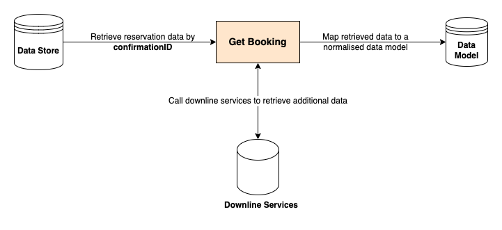

# Get Booking

## Description

The **[Get Booking](https://developer.sabre.com/docs/rest_apis/trip/orders/booking_management)** method provides a normalized view of reservations by combining both **Sabre Passenger Name Records (PNRs)** and **Sabre Orders**.

This is achieved by executing internal calls to the PNR and Order domains, respectively, and then consolidating the information into a single normalized response.

Additionally, this API sources extra content from other Sabre internal domains (Ticketing, Pricing, etc.) to provide a holistic view of Sabre reservations and to support traveler-oriented use cases (for example, "can I change my ticket?").

## Why to use the Get Booking method

* It simplifies the booking retrieval process by removing the need to use individual/granular APIs to retrieve a reservation.

* It retrieves a normalized view of the reservation regardless of the content sources (PNR, NDC Order).

* It provides additional data relevant for travelers (e.g., fare rules) as well as data elements that are not stored in the Sabre PNR (e.g., ticket details and more).

* The method retrieves reservation in a stateless way.

## Steps

Get Booking executes the following steps to display a booking:



## Requests and Responses

### Display booking

To ensure successful booking retrieval, the request should contain the below information:

Add `confirmationId` (PNR Locator or Order Id) in the Get Booking request:

```json
{
  "confirmationId": "XXXXXX"
}
```

### Display booking and validate surname

To ensure successful booking retrieval with surname validation, the request should contain the below information:

1. Add `confirmationId` (PNR Locator or Order Id).
2. Add `surname` of the lead/first traveler.
  
>**Note**: The API will validate if the surname matches the data in the reservation before retrieving it.

```json
{
  "confirmationId": "XXXXXX",
  "surname": "Smith"
}
```

### Display selected booking elements

To ensure successful booking retrieval with a limited number of elements in the response, the request should contain the below information:

1. Add `confirmationId` (PNR Locator or Order Id).
2. Add `returnOnly` element with a list of parameter values you want to retrieve.

>**Note**: The full list of possible returnOnly values can be found in the OpenAPI specification under the Reference Documentation tab.

```json
{
  "confirmationId": "XXXXXX",
  "returnOnly":[
    "TRAVELERS", "FLIGHTS"
  ]
}
```

## Request and Response Paramters

### Request Parameters

Contains both required and optional elements to make a booking request.

```json
{
  "confirmationId": "GLEBNY",
  "bookingSource": "SABRE",
  "givenName": "John",
  "middleName": "W",
  "surname": "Smith",
  "returnOnly": [
    "FLIGHTS"
  ],
  "extraFeatures": {
    "returnFrequentRenter": false,
    "returnFiscalId": false
  },
  "unmaskPaymentCardNumbers": false
}
```

Here's a tabular documentation for the request parameters:

| Parameter                | Type                   | Description                                                                                                                                                                                                                             |
|--------------------------|------------------------|-----------------------------------------------------------------------------------------------------------------------------------------------------------------------------------------------------------------------------------------|
| confirmationId*          | string                 | The booking reference ID as shown in the source supplier/vendor system. For SABRE, this is the PNR Locator value.                                                                                                                       |
| bookingSource            | BookingSourceEnum      | Represents the source of the booking.                                                                                                                                                                                                  |
| givenName                | string                 | The traveler's first name.                                                                                                                                                                                                             |
| middleName               | string                 | The middle name or the initial of the middle name of the traveler.                                                                                                                                                                      |
| surname                  | string                 | The traveler's last name.                                                                                                                                                                                                              |
| returnOnly               | ReturnOnlyEnum[]       | Lists the response sections which are returned by the service. If this list is empty or not provided, then the full structure is returned. This allows exclusion or simplification of calls to downline APIs, improving performance. |
| extraFeatures            | ExtraFeatures {...}     | Additional features or options related to the booking request.                                                                                                                                                                          |
| unmaskPaymentCardNumbers | boolean                | If true, the application unmasks payment card information stored in the booking. To display this data, the Employee Profile Record (EPR) needs to include the CCVIEW keyword.                                                       |

>**Note**: * indicates a `required` parameter.

### Response Parameters

```json
{
  "bookingId": "1SXXX1A2B3C4D",
  "startDate": "2019-07-09",
  "endDate": "2019-07-19",
  "isCancelable": false,
  "isTicketed": false,
  "agencyCustomerNumber": "1234567",
  "creationDetails": {
    "creationUserSine": "A12",
    "creationDate": "2021-01-09",
    "creationTime": "15:00",
    "purchaseDeadlineDate": "2023-01-09",
    "purchaseDeadlineTime": "15:00",
    "agencyIataNumber": "99119911",
    "userWorkPcc": "AB12",
    "userHomePcc": "CD34",
    "primeHostId": "1S"
  },
  "contactInfo": {
    "emails": [
      "travel@sabre.com"
    ],
    "phones": [
      "+1-555-123-4567"
    ],
    "faxes": [
      "+1-555-123-4567"
    ],
    "emergencyPhones": [
      "+1-555-123-4567"
    ]
  },
  "travelers": [
    {
      "givenName": "John",
      "middleName": "W",
      "surname": "Smith",
      "birthDate": "1970-01-23",
      "type": "ADULT",
      "passengerCode": "ADT",
      "nameAssociationId": "3",
      "nameReferenceCode": "C05",
      "isGrouped": true,
      "emails": [
        "john@smith.family.priv"
      ],
      "phones": [
        {
          "number": "+1-555-123-4567",
          "label": "M"
        }
      ],
      "remarks": [
        {
          "type": "GENERAL",
          "alphaCode": "T",
          "text": "XXATW/"
        }
      ],
      "address": {
        "street": "1230 Ellen Ave, apt 10",
        "city": "Dallas",
        "stateProvince": "TX",
        "postalCode": "75063",
        "countryCode": "US",
        "name": "John Smith",
        "freeText": "John Smith\n1230 Ellen Ave, Apt 10\nDallas, TX 75063\nUS\n"
      },
      "identityDocuments": [
        {
          "documentNumber": "0123456789",
          "documentType": "PASSPORT",
          "documentSubType": "RUC",
          "expiryDate": "2024-07-09",
          "issuingCountryCode": "US",
          "residenceCountryCode": "US",
          "placeOfIssue": "ROME",
          "placeOfBirth": "KOSZALIN",
          "hostCountryCode": "US",
          "issueDate": "2019-07-09",
          "givenName": "John",
          "middleName": "Jack",
          "surname": "Smith",
          "birthDate": "1980-12-02",
          "gender": "FEMALE",
          "isPrimaryDocumentHolder": true,
          "isLapChildDocument": true,
          "residenceDestinationAddress": {
            "street": "1230 Ellen Ave, apt 10",
            "city": "Dallas",
            "stateProvince": "TX",
            "postalCode": "75063",
            "countryCode": "US"
          },
          "flightIndices": [
            1
          ],
          "itemId": "76c2817b178cc264fa44cf85df1da5fb9e1b963006b2339aa5edc09129415bba5fcf5bf91a5f"
        }
      ],
      "loyaltyPrograms": [
        {
          "supplierCode": "AA",
          "programType": "FREQUENT_FLYER",
          "programNumber": "987654321",
          "tierLevel": 3,
          "receiverCode": "UA"
        }
      ],
      "ancillaries": [
        {
          "commercialName": "UPTO33LB 15KG BAGGAGE",
          "numberOfItems": 1,
          "reasonForIssuanceCode": "C",
          "reasonForIssuanceName": "BAGGAGE",
          "subcode": "05Z",
          "airlineCode": "EY",
          "vendorCode": "EY",
          "source": "ATPCO",
          "electronicMiscellaneousDocumentNumber": "6074333222111",
          "isRefundable": true,
          "isCommissionable": false,
          "flights": [
            {
              "itemId": "12"
            }
          ],
          "statusCode": "HD",
          "statusName": "Confirmed",
          "totals": {
            "subtotal": "100.00",
            "taxes": "8.00",
            "fees": "20.00",
            "total": "128.00",
            "currencyCode": "USD"
          }
        }
      ]
    }
  ],
  "travelersGroup": {
    "itemId": "3",
    "name": "GROUP ONE",
    "numberOfTravelers": 1,
    "numberOfTravelersRemaining": 1
  },
  "flights": [
    {
      "itemId": "12",
      "confirmationId": "NIEBNY",
      "sourceType": "NDC",
      "flightNumber": 123,
      "airlineCode": "AA",
      "airlineName": "AMERICAN AIRLINES",
      "operatingFlightNumber": 321,
      "operatingAirlineCode": "UA",
      "operatingAirlineName": "UNITED AIRLINES",
      "fromAirportCode": "DFW",
      "toAirportCode": "HNL",
      "departureDate": "2019-07-09",
      "departureTime": "09:15",
      "updatedDepartureDate": "2019-07-09",
      "updatedDepartureTime": "09:25",
      "departureTerminalName": "Terminal D",
      "departureGate": "D",
      "arrivalDate": "2019-07-09",
      "arrivalTime": "12:28",
      "updatedArrivalDate": "2019-07-09",
      "updatedArrivalTime": "12:38",
      "arrivalTerminalName": "Terminal 1",
      "arrivalGate": "1",
      "seats": [
        {
          "number": "13A",
          "characteristics": [
            "K"
          ],
          "statusCode": "AF",
          "statusName": "Confirmed"
        }
      ],
      "numberOfSeats": 1,
      "cabinTypeName": "Coach",
      "cabinTypeCode": "C",
      "aircraftTypeCode": "E90",
      "aircraftTypeName": "EMBRAER EMB E90",
      "bookingClass": "Y",
      "meals": [
        {
          "code": "H",
          "description": "Hot meal"
        }
      ],
      "flightStatusCode": "AF",
      "flightStatusName": "Confirmed",
      "durationInMinutes": 590,
      "distanceInMiles": 5143,
      "hiddenStopAircraftTypeCode": "E90",
      "hiddenStopAircraftTypeName": "EMBRAER EMB E90",
      "hiddenStopAirportCode": "HAV",
      "hiddenStopArrivalDate": "2019-07-09",
      "hiddenStopArrivalTime": "09:15",
      "hiddenStopDepartureDate": "2019-07-09",
      "hiddenStopDepartureTime": "09:15",
      "hiddenStops": [
        {
          "airportCode": "DFW",
          "departureDate": "2019-07-09",
          "departureTime": "09:15",
          "arrivalDate": "2019-07-09",
          "arrivalTime": "12:28",
          "aircraftTypeCode": "E90",
          "aircraftTypeName": "EMBRAER EMB E90",
          "durationInMinutes": 300
        }
      ],
      "travelerIndices": [
        1
      ],
      "identityDocuments": [
        {
          "itemId": "76c2817b178cc264fa44cf85df1da5fb9e1b963006b2339aa5edc09129415bba5fcf5bf91a5f",
          "status": "Confirmed"
        }
      ],
      "isPast": false
    }
  ],
  "journeys": [
    {
      "firstAirportCode": "DFW",
      "departureDate": "2019-07-09",
      "departureTime": "09:15",
      "lastAirportCode": "HNL",
      "numberOfFlights": 1
    }
  ],
  "fareRules": [
    {
      "originAirportCode": "DFW",
      "destinationAirportCode": "ATL",
      "owningAirlineCode": "AA",
      "passengerCode": "ADT",
      "isRefundable": true,
      "refundPenalties": [
        {
          "applicability": "BEFORE_DEPARTURE",
          "conditionsApply": false,
          "penalty": {
            "amount": "100.00",
            "currencyCode": "USD"
          }
        }
      ],
      "isChangeable": true,
      "exchangePenalties": [
        {
          "applicability": "BEFORE_DEPARTURE",
          "conditionsApply": false,
          "penalty": {
            "amount": "100.00",
            "currencyCode": "USD"
          }
        }
      ]
    }
  ],
  "fareOffers": [
    {
      "travelerIndices": [
        1
      ],
      "flights": [
        {
          "itemId": "12"
        }
      ],
      "cabinBaggageAllowance": {
        "maximumPieces": 1,
        "totalWeightInPounds": 50,
        "totalWeightInKilograms": 23,
        "baggagePieces": [
          {
            "maximumSizeInInches": 46,
            "maximumSizeInCentimeters": 118,
            "maximumWeightInPounds": 50,
            "maximumWeightInKilograms": 23,
            "numberOfPieces": 1,
            "specialItemDescription": "SKI EQUIPMENT",
            "isCheckInOnly": true,
            "fee": {
              "amount": "100.00",
              "currencyCode": "USD"
            }
          }
        ]
      },
      "checkedBaggageAllowance": {
        "maximumPieces": 1,
        "totalWeightInPounds": 50,
        "totalWeightInKilograms": 23,
        "baggagePieces": [
          {
            "maximumSizeInInches": 46,
            "maximumSizeInCentimeters": 118,
            "maximumWeightInPounds": 50,
            "maximumWeightInKilograms": 23,
            "numberOfPieces": 1,
            "specialItemDescription": "SKI EQUIPMENT",
            "isCheckInOnly": true,
            "fee": {
              "amount": "100.00",
              "currencyCode": "USD"
            }
          }
        ]
      },
      "cabinBaggageCharges": [
        {
          "maximumSizeInInches": 46,
          "maximumSizeInCentimeters": 118,
          "maximumWeightInPounds": 50,
          "maximumWeightInKilograms": 23,
          "numberOfPieces": 1,
          "specialItemDescription": "SKI EQUIPMENT",
          "isCheckInOnly": true,
          "fee": {
            "amount": "100.00",
            "currencyCode": "USD"
          }
        }
      ],
      "checkedBaggageCharges": [
        {
          "maximumSizeInInches": 46,
          "maximumSizeInCentimeters": 118,
          "maximumWeightInPounds": 50,
          "maximumWeightInKilograms": 23,
          "numberOfPieces": 1,
          "specialItemDescription": "SKI EQUIPMENT",
          "isCheckInOnly": true,
          "fee": {
            "amount": "100.00",
            "currencyCode": "USD"
          }
        }
      ]
    }
  ],
  "fares": [
    {
      "creationDetails": {
        "creationUserSine": "A12",
        "creationDate": "2021-01-09",
        "creationTime": "15:00",
        "purchaseDeadlineDate": "2023-01-09",
        "purchaseDeadlineTime": "15:00",
        "agencyIataNumber": "99119911",
        "userWorkPcc": "AB12",
        "userHomePcc": "CD34",
        "primeHostId": "1S"
      },
      "airlineCode": "AA",
      "fareCalculationLine": "BUE AA DFW Q430.00 5740.00NUC6170.00END ROE1.00 XT175.50TQ175.50QO315.90US96.50YC122.90XY69.50XA",
      "tourCode": "123456789ABCDE",
      "isNegotiatedFare": true,
      "travelerIndices": [
        1
      ],
      "commission": {
        "commissionAmount": "25.00",
        "currencyCode": "USD",
        "commissionPercentage": "5.00"
      },
      "fareConstruction": [
        {
          "flights": [
            {
              "itemId": "12"
            }
          ],
          "flightIndices": [
            1
          ],
          "fareBasisCode": "ABCDE10",
          "baseRate": {
            "amount": "100.00",
            "currencyCode": "USD"
          },
          "brandFareCode": "ECOFLEX",
          "brandFareName": "ECO FLEX",
          "brandProgramCode": "CFFLH",
          "brandProgramName": "LH BRANDED FARES INTERCONT",
          "brandAttributes": [
            {
              "itemId": "SABRE_NDCC_ID_1",
              "description": "Qantas Points"
            }
          ],
          "isCurrentItinerary": false,
          "checkedBaggageAllowance": {
            "maximumPieces": 1,
            "totalWeightInPounds": 50,
            "totalWeightInKilograms": 23,
            "baggagePieces": [
              {
                "maximumSizeInInches": 46,
                "maximumSizeInCentimeters": 118,
                "maximumWeightInPounds": 50,
                "maximumWeightInKilograms": 23,
                "numberOfPieces": 1,
                "specialItemDescription": "SKI EQUIPMENT",
                "isCheckInOnly": true,
                "fee": {
                  "amount": "100.00",
                  "currencyCode": "USD"
                }
              }
            ]
          }
        }
      ],
      "taxBreakdown": [
        {
          "taxCode": "XY",
          "taxAmount": {
            "amount": "100.00",
            "currencyCode": "USD"
          }
        }
      ],
      "totals": {
        "subtotal": "100.00",
        "taxes": "8.00",
        "fees": "20.00",
        "total": "128.00",
        "currencyCode": "USD"
      },
      "pricingTypeCode": "S",
      "pricingTypeName": "Manual",
      "pricingStatusCode": "A",
      "pricingStatusName": "Active",
      "hasValidPricing": false,
      "requestedTravelerType": "C08",
      "pricedTravelerType": "C08",
      "recordTypeCode": "PQ",
      "recordTypeName": "Price Quote",
      "recordId": "12"
    }
  ],
  "remarks": [
    {
      "type": "GENERAL",
      "alphaCode": "T",
      "text": "XXATW/"
    }
  ],
  "hotels": [
    {
      "itemId": "12",
      "confirmationId": "23428937429074",
      "hotelName": "Ilia Hotel and Luxury Suites",
      "address": {
        "street": "1230 Ellen Ave, apt 10",
        "city": "Dallas",
        "stateProvince": "TX",
        "postalCode": "75063",
        "countryCode": "US",
        "name": "John Smith",
        "freeText": "John Smith\n1230 Ellen Ave, Apt 10\nDallas, TX 75063\nUS\n",
        "cityCode": "DFW"
      },
      "checkInDate": "2019-07-09",
      "checkInTime": "15:00",
      "checkOutDate": "2019-07-19",
      "checkOutTime": "11:00",
      "corporateDiscountCode": 6878700,
      "leadTravelerIndex": 1,
      "room": {
        "roomType": "2 double beds",
        "quantity": 1,
        "description": "Deluxe Room, 2 Double Beds",
        "roomTypeCode": "100144834",
        "productCode": "SM3A00",
        "roomRate": {
          "amount": "100.00",
          "currencyCode": "USD"
        },
        "travelerIndices": [
          1
        ],
        "agencyCommission": {
          "commissionAmount": "25.00",
          "currencyCode": "USD",
          "commissionPercentage": "5.00"
        }
      },
      "isRefundable": false,
      "refundPenalties": [
        {
          "applicableFromDate": "2019-07-07T16:00:00Z",
          "applicableToDate": "2019-07-09T16:00:00Z",
          "penalty": {
            "amount": "100.00",
            "currencyCode": "USD"
          }
        }
      ],
      "refundPenaltyPolicyCode": "01D",
      "hotelStatusCode": "HK",
      "hotelStatusName": "Confirmed",
      "chainCode": "BY",
      "chainName": "Banyan Tree Hotels and Resorts",
      "propertyId": "100144834",
      "contactInfo": {
        "emails": [
          "travel@sabre.com"
        ],
        "phones": [
          "+1-555-123-4567"
        ],
        "faxes": [
          "+1-555-123-4567"
        ],
        "emergencyPhones": [
          "+1-555-123-4567"
        ]
      },
      "specialInstructions": "Need a wi-fi in the room.",
      "guaranteeTypeCode": 5,
      "guaranteeTypeName": "Credit card",
      "guaranteePaymentNote": "GVI4XXXXXXXXXXX1111EXP 01 25-HOTEL",
      "paymentPolicy": "DEPOSIT",
      "payment": {
        "subtotal": "100.00",
        "taxes": "8.00",
        "fees": "20.00",
        "total": "128.00",
        "currencyCode": "USD"
      },
      "numberOfGuests": 1,
      "associatedFlightDetails": {
        "arrivalAirlineCode": "AA",
        "arrivalFlightNumber": 123,
        "arrivalTime": "12:28",
        "departureAirlineCode": "AA",
        "departureFlightNumber": 123,
        "departureTime": "09:15"
      },
      "sourceTypeCode": 100,
      "sourceTypeName": "Sabre GDS"
    }
  ],
  "cars": [
    {
      "itemId": "12",
      "confirmationId": "843296421",
      "travelerIndex": 1,
      "vendorName": "National",
      "vendorCode": "ZE",
      "pickUpLocationCode": "DFW",
      "pickUpAddress": {
        "street": "1230 Ellen Ave, apt 10",
        "city": "Dallas",
        "stateProvince": "TX",
        "postalCode": "75063",
        "countryCode": "US",
        "name": "John Smith",
        "freeText": "John Smith\n1230 Ellen Ave, Apt 10\nDallas, TX 75063\nUS\n"
      },
      "pickUpDate": "2019-07-09",
      "pickUpTime": "13:00",
      "pickUpContactInfo": {
        "emails": [
          "travel@sabre.com"
        ],
        "phones": [
          "+1-555-123-4567"
        ],
        "faxes": [
          "+1-555-123-4567"
        ],
        "emergencyPhones": [
          "+1-555-123-4567"
        ]
      },
      "dropOffLocationCode": "DEN",
      "dropOffAddress": {
        "street": "1230 Ellen Ave, apt 10",
        "city": "Dallas",
        "stateProvince": "TX",
        "postalCode": "75063",
        "countryCode": "US",
        "name": "John Smith",
        "freeText": "John Smith\n1230 Ellen Ave, Apt 10\nDallas, TX 75063\nUS\n"
      },
      "dropOffDate": "2019-07-19",
      "dropOffTime": "12:00",
      "dropOffContactInfo": {
        "emails": [
          "travel@sabre.com"
        ],
        "phones": [
          "+1-555-123-4567"
        ],
        "faxes": [
          "+1-555-123-4567"
        ],
        "emergencyPhones": [
          "+1-555-123-4567"
        ]
      },
      "collectionAddress": {
        "street": "1230 Ellen Ave, apt 10",
        "city": "Dallas",
        "stateProvince": "TX",
        "postalCode": "75063",
        "countryCode": "US"
      },
      "collectionSite": {
        "id": "ABC123",
        "name": "TEST LOCATION",
        "phone": "8175551212"
      },
      "deliveryAddress": {
        "street": "1230 Ellen Ave, apt 10",
        "city": "Dallas",
        "stateProvince": "TX",
        "postalCode": "75063",
        "countryCode": "US"
      },
      "deliverySite": {
        "id": "ABC123",
        "name": "TEST LOCATION",
        "phone": "8175551212"
      },
      "isRefundable": false,
      "refundPenalties": [
        {
          "applicableFromDate": "2019-07-07T16:00:00Z",
          "applicableToDate": "2019-07-09T16:00:00Z",
          "penalty": {
            "amount": "100.00",
            "currencyCode": "USD"
          }
        }
      ],
      "carStatusCode": "HK",
      "carStatusName": "Confirmed",
      "vehicleTypeCode": "MBMR",
      "vehicleTypeName": "Two/Three Door",
      "numberOfVehicles": 1,
      "rateCode": "RCUD1",
      "distanceAllowance": "UNL",
      "guaranteePaymentNote": "GVI4XXXXXXXXXXX0008EXP 03 22-TEST CAR",
      "specialInstructions": "NON-SMOKING CAR PLEASE",
      "payment": {
        "subtotal": "100.00",
        "taxes": "8.00",
        "fees": "20.00",
        "total": "128.00",
        "currencyCode": "USD"
      }
    }
  ],
  "trains": [
    {
      "itemId": "12",
      "confirmationId": "76E220",
      "trainNumber": "822",
      "trainName": "Heartland Flyer",
      "vendorCode": "2V",
      "vendorName": "Amtrak",
      "operatingVendorCode": "2V",
      "operatingVendorName": "Amtrak",
      "fromStationCode": "FTW",
      "fromStationName": "Central Station",
      "toStationCode": "ATL",
      "toStationName": "Peachtree Station",
      "departureDate": "2019-07-10",
      "departureTime": "19:15",
      "arrivalDate": "2019-07-10",
      "arrivalTime": "23:10",
      "isRefundable": true,
      "trainStatusCode": "HK",
      "trainStatusName": "Confirmed",
      "payment": {
        "subtotal": "100.00",
        "taxes": "8.00",
        "fees": "20.00",
        "total": "128.00",
        "currencyCode": "USD"
      }
    }
  ],
  "cruises": [
    {
      "itemId": "12",
      "confirmationId": "XPCD8Q",
      "vendorCode": "PC",
      "shipCode": "RP",
      "shipName": "Royal Princess",
      "fromPortCode": "ANC",
      "toPortCode": "YVR",
      "departureDate": "2019-07-12",
      "departureTime": "16:00",
      "arrivalDate": "2019-07-15",
      "arrivalTime": "09:00",
      "numberOfGuests": 2,
      "cabinNumber": "C101",
      "cruiseStatusCode": "GK",
      "cruiseStatusName": "Confirmed"
    }
  ],
  "allSegments": [
    {
      "id": "12",
      "type": "FLIGHT",
      "text": "123",
      "vendorCode": "AA",
      "date": "2019-07-09",
      "time": "09:15",
      "locationCode": "ATL",
      "address": {
        "street": "1230 Ellen Ave, apt 10",
        "city": "Dallas",
        "stateProvince": "TX",
        "postalCode": "75063",
        "countryCode": "US",
        "name": "John Smith",
        "freeText": "John Smith\n1230 Ellen Ave, Apt 10\nDallas, TX 75063\nUS\n"
      },
      "startDate": "2019-07-09",
      "startTime": "09:15",
      "startLocationCode": "DFW",
      "startAddress": {
        "street": "1230 Ellen Ave, apt 10",
        "city": "Dallas",
        "stateProvince": "TX",
        "postalCode": "75063",
        "countryCode": "US",
        "name": "John Smith",
        "freeText": "John Smith\n1230 Ellen Ave, Apt 10\nDallas, TX 75063\nUS\n"
      },
      "endDate": "2019-07-09",
      "endTime": "12:28",
      "endLocationCode": "HNL",
      "endAddress": {
        "street": "1230 Ellen Ave, apt 10",
        "city": "Dallas",
        "stateProvince": "TX",
        "postalCode": "75063",
        "countryCode": "US",
        "name": "John Smith",
        "freeText": "John Smith\n1230 Ellen Ave, Apt 10\nDallas, TX 75063\nUS\n"
      }
    }
  ],
  "flightTickets": [
    {
      "number": "0167489825830",
      "date": "2019-07-01",
      "agencyIataNumber": "12344321",
      "airlineCode": "AA",
      "travelerIndex": 1,
      "flightCoupons": [
        {
          "itemId": "12",
          "couponStatus": "Printed",
          "couponStatusCode": "PR"
        }
      ],
      "allCoupons": [
        {
          "couponStatus": "Printed",
          "couponStatusCode": "PR",
          "itemId": "12"
        }
      ],
      "payment": {
        "subtotal": "100.00",
        "taxes": "8.00",
        "fees": "20.00",
        "total": "128.00",
        "currencyCode": "USD"
      },
      "ticketStatusName": "Issued",
      "ticketStatusCode": "TE",
      "ticketingPcc": "G7HE"
    }
  ],
  "payments": {
    "flightTotals": [
      {
        "subtotal": "100.00",
        "taxes": "8.00",
        "fees": "20.00",
        "total": "128.00",
        "currencyCode": "USD"
      }
    ],
    "flightCurrentTotals": [
      {
        "subtotal": "100.00",
        "taxes": "8.00",
        "fees": "20.00",
        "total": "128.00",
        "currencyCode": "USD"
      }
    ],
    "hotelTotals": [
      {
        "subtotal": "100.00",
        "taxes": "8.00",
        "fees": "20.00",
        "total": "128.00",
        "currencyCode": "USD"
      }
    ],
    "carTotals": [
      {
        "subtotal": "100.00",
        "taxes": "8.00",
        "fees": "20.00",
        "total": "128.00",
        "currencyCode": "USD"
      }
    ],
    "trainTotals": [
      {
        "subtotal": "100.00",
        "taxes": "8.00",
        "fees": "20.00",
        "total": "128.00",
        "currencyCode": "USD"
      }
    ],
    "formsOfPayment": [
      {
        "type": "CHECK",
        "cardTypeCode": "VI",
        "cardNumber": "4537156488578956",
        "cardSecurityCode": "123",
        "expiryDate": "2024-07",
        "cardHolder": {
          "givenName": "John",
          "surname": "Smith",
          "email": "john@smith.family.priv",
          "phone": "+1-555-123-4567",
          "address": {
            "street": "1230 Ellen Ave, apt 10",
            "city": "Dallas",
            "stateProvince": "TX",
            "postalCode": "75063",
            "countryCode": "US"
          }
        },
        "manualApproval": {
          "code": "12345",
          "requestDateTime": "2019-07-09T09:15:00Z",
          "expiryDateTime": "2019-07-09T09:15:00Z",
          "airlineCode": "AA",
          "amount": "100.00",
          "currencyCode": "USD"
        },
        "authentications": [
          {
            "secureAuthenticationValue": "ABC123455533533444455555678",
            "secureTransactionId": "ABCDEFGHI123456789012!.1234567890123",
            "issueCode": "AO",
            "resultCode": "OK",
            "cardNumberCollectionCode": "K",
            "channelCode": "MO",
            "electronicCommerceIndicator": "12",
            "exemptionTypeCode": "SC",
            "updatedDateTime": "2020-07-07T16:00:00Z",
            "mandateTypeCode": "NA",
            "merchantName": "TEST CREDIT CARD",
            "originalPaymentReference": "1234547839012345",
            "amount": "1234.56",
            "currencyCode": "USD",
            "tokenAuthenticationValue": "ABC3434334343556677487312567",
            "verificationResultCode": "PASS",
            "version": "120"
          }
        ],
        "extendedPayment": 12,
        "miscellaneousCreditCode": "PL189947",
        "numberOfInstallments": 4,
        "airlinePlanCode": "RG065",
        "installmentAmount": "100",
        "netBalance": "300.20",
        "virtualCard": {
          "customerAccountCode": "John",
          "agencyEmail": "john@smith.family.priv",
          "hotelFax": "+1-555-123-4567",
          "hotelName": "Ilia Hotel and Luxury Suites",
          "roomType": "2 double beds",
          "roomDescription": "Deluxe Room, 2 Double Beds",
          "rateAmount": {
            "amount": "100.00",
            "currencyCode": "USD"
          },
          "virtualCardCharges": [
            "Breakfast"
          ]
        },
        "agencyIataNumber": "129345738",
        "agencyAddress": {
          "street": "1230 Ellen Ave, apt 10",
          "city": "Dallas",
          "stateProvince": "TX",
          "postalCode": "75063",
          "countryCode": "US",
          "name": "John Smith",
          "freeText": "John Smith\n1230 Ellen Ave, Apt 10\nDallas, TX 75063\nUS\n"
        },
        "corporateId": "CC006",
        "companyAddress": {
          "street": "1230 Ellen Ave, apt 10",
          "city": "Dallas",
          "stateProvince": "TX",
          "postalCode": "75063",
          "countryCode": "US",
          "name": "John Smith",
          "freeText": "John Smith\n1230 Ellen Ave, Apt 10\nDallas, TX 75063\nUS\n"
        },
        "voucher": {
          "billingNumber": "1234567",
          "type": "FC"
        }
      }
    ]
  },
  "otherServices": [
    {
      "airlineCode": "AA",
      "chainCode": "BY",
      "vendorCode": "ZE",
      "travelerIndex": 1,
      "serviceMessage": "/CX-J674A0957C0"
    }
  ],
  "futureTicketingPolicy": {
    "ticketingPcc": "G7RE",
    "queueNumber": "55",
    "ticketingDate": "2019-07-09",
    "ticketingTime": "11:00",
    "comment": "TICKET BEFORE TUES"
  },
  "specialServices": [
    {
      "travelerIndices": [
        1
      ],
      "flights": [
        {
          "itemId": "12"
        }
      ],
      "code": "WCHR",
      "name": "Wheelchair/Passenger can walk up stairs",
      "message": "/PREPAID",
      "statusCode": "HK",
      "statusName": "Confirmed"
    }
  ],
  "retentionEndDate": "2024-01-30",
  "retentionLabel": "RETENTION DATE",
  "timestamp": "2020-10-28T11:11:21Z",
  "bookingSignature": "76c2817b178cc264fa44cf85df1da5fb9e1b963006b2339aa5edc09129415bba5fcf5bf91a5f",
  "request": {
    "confirmationId": "GLEBNY",
    "bookingSource": "SABRE",
    "givenName": "John",
    "middleName": "W",
    "surname": "Smith",
    "returnOnly": [
      "FLIGHTS"
    ],
    "extraFeatures": {
      "returnFrequentRenter": false,
      "returnFiscalId": false
    },
    "unmaskPaymentCardNumbers": false
  },
  "errors": [
    {
      "category": "BAD_REQUEST",
      "type": "REQUIRED_FIELD_MISSING",
      "description": "may not be null",
      "fieldPath": "someObject.someFieldName",
      "fieldName": "someName",
      "fieldValue": "field value"
    }
  ]
}
```

## Get Booking - Error List

Below are all possible errors returned by the Get Booking endpoint:

| Error Type             | Error Category     | Description                                                                                                                                                                                                                                                                                                                      |
|------------------------|--------------------|----------------------------------------------------------------------------------------------------------------------------------------------------------------------------------------------------------------------------------------------------------------------------------------------------------------------------------|
| INVALID_MESSAGE        | APPLICATION_ERROR  | Incorrect booking request.                                                                                                                                                                                                                                                                                                       |
| UNAUTHORIZED_ACCESS    | UNAUTHORIZED       | fareOffers could not be retrieved. The service GetAncillaryOffersRQ returned an authorization failure. Please verify the used credentials with your account manager.                                                                                                                                                            |
| UNAUTHORIZED_ACCESS    | UNAUTHORIZED       | fareRules could not be retrieved. The service PO_PNRPricingRQ returned an authorization failure. Please verify the used credentials with your account manager.                                                                                                                                                               |
| UNAUTHORIZED_ACCESS    | UNAUTHORIZED       | Electronic document details could not be retrieved. The service Get Electronic Document API (TKT_ElectronicDocumentServicesRQ) is available to Sabre travel agency subscribers only. Please verify the used credentials with your account manager.                                                                                |
| UNAUTHORIZED_ACCESS    | UNAUTHORIZED       | Expired or invalid security token.                                                                                                                                                                                                                                                                                              |
| UNAUTHORIZED_ACCESS    | UNAUTHORIZED       | The booking cannot be retrieved due to authorization issues in security systems. Verify your credentials with your account manager.                                                                                                                                                                                            |
| UNAUTHORIZED_ACCESS    | RESOURCE_RESTRICTED | Access to the selected booking is restricted. Verify your credentials and Travel Journal Record settings with your account manager.                                                                                                                                                                                           |
| INTERNAL_SERVER_ERROR  | INTERNAL_SERVER_ERROR | Exception while processing --> %s%s                                                                                                                                                                                                                                                                                           |
| INTERNAL_SERVER_TIMEOUT| APPLICATION_ERROR  | Call to internal service timed out.                                                                                                                                                                                                                                                                                              |
| BOOKING_NOT_FOUND      | RESOURCE_NOT_FOUND | Booking cannot be found.                                                                                                                                                                                                                                                                                                         |
| RESOURCE_UNAVAILABLE   | WARNING            | Some resource cannot be populated for given reservation. Details are returned in fieldName, fieldPath, and fieldValue.                                                                                                                                                                                                         |
| RESOURCE_UNAVAILABLE   | WARNING            | Resource cannot be populated. There is no pricing information saved in the booking for passengerCode%s [%s] for the trip%s between [%s].                                                                                                                                                                                        |
| RESOURCE_UNAVAILABLE   | WARNING            | Resource cannot be populated. Details not available for manually generated pricing information saved in the booking.                                                                                                                                                                                                             |
| RESOURCE_UNAVAILABLE   | WARNING            | Unable to provide ticketStatusName. The supported ticketStatusCodes are: %s.                                                                                                                                                                                                                                                    |
| RESOURCE_UNAVAILABLE   | WARNING            | Details for ticket with number: %s cannot be populated.                                                                                                                                                                                                                                                                         |
| RESOURCE_UNAVAILABLE   | WARNING            | Cannot populate some data for the flight.                                                                                                                                                                                                                                                                                       |
| RESOURCE_UNAVAILABLE   | WARNING            | fareRules.isRefundable cannot be populated for fareRules.passengerCode:                                                                                                                                                                                                                                                          |
| RESOURCE_UNAVAILABLE   | WARNING            | aircraftTypeCode, meals, durationInMinutes & distanceInMiles cannot be populated for flight:                                                                                                                                                                                                                                   |
| RESOURCE_UNAVAILABLE   | WARNING            | Car location details for code: %s cannot be populated.                                                                                                                                                                                                                                                                          |
| RESOURCE_UNAVAILABLE   | WARNING            | Unable to populate additional data for %s: %s                                                                                                                                                                                                                                                                                   |
| RESOURCE_UNAVAILABLE   | WARNING            | FareRules can not be populated because the ticket is voided, refunded or exchanged.                                                                                                                                                                                                                                              |
| RESOURCE_UNAVAILABLE   | WARNING            | FareRules can not be populated because the Price Quote %s is invalid.                                                                                                                                                                                                                                                           |
| RESOURCE_UNAVAILABLE   | WARNING            | FareRules can not be populated because the Price Quotes %s are invalid.                                                                                                                                                                                                                                                          |
| RESOURCE_UNAVAILABLE   | WARNING            | FareRules can not be populate for this passengerCode. There's no valid Ticket present in the booking.                                                                                                                                                                                                                           |
| RESOURCE_UNAVAILABLE   | WARNING            | FareRules can not be populated for this passengerCode for part of the booking. There's no valid Ticket present in the booking for flights[%s].                                                                                                                                                                                 |
| RESOURCE_UNAVAILABLE   | WARNING            | Hotel chainName cannot be populated based on the chainCode: %s                                                                                                                                                                                                                                                                   |
| RESOURCE_UNAVAILABLE   | WARNING            | AircraftTypeName cannot be populated based on the aircraftTypeCode: %s                                                                                                                                                                                                                                                          |
| RESOURCE_UNAVAILABLE   | WARNING            | Baggage allowance cannot be returned for NDC flights.                                                                                                                                                                                                                                                                            |
| RESOURCE_UNAVAILABLE   | WARNING            | Fare.travelerIndices not populated: Traveler with nameId=%s not found in the reservation.                                                                                                                                                                                                                                      |
| RESOURCE_UNAVAILABLE   | WARNING            | FareRules cannot be populated because a Price Quote or Ticket isn't present in the booking.                                                                                                                                                                                                                                     |
| BOOKING_RETRIEVAL      | APPLICATION_ERROR  | Booking cannot be retrieved.                                                                                                                                                                                                                                                                                                      |
| INVALID_VALUE          | BAD_REQUEST        | Invalid filtering option. Available options are:                                                                                                                                                                                                                                                                                 |
| INVALID_VALUE          | BAD_REQUEST        | Validation failed:                                                                                                                                                                                                                                                                                                               |
| UNPARSEABLE_REQUEST    | BAD_REQUEST        | Validation error.                                                                                                                                                                                                                                                                                                                 |
| UNPARSEABLE_REQUEST    | BAD_REQUEST        | Invalid syntax.                                                                                                                                                                                                                                                                                                                   |
| DOWNLINE_SERVICE_FAILURE | APPLICATION_ERROR | General problem with %s service.                                                                                                                                                                                                                                                                                                  |
| DOWNLINE_SERVICE_FAILURE | APPLICATION_ERROR | Cannot connect to underlying system.                                                                                                                                                                                                                                                                                              |
| FAULT_RESPONSE         | APPLICATION_ERROR | The underlying system cannot process the request at this time.                                                                                                                                                                                                                                                                   |
| INVALID_JOURNEYS       | WARNING            | The journey information cannot be populated for this booking. Verify itinerary details against duplicated flight routes or incorrect dates.                                                                                                                                                                                      |
